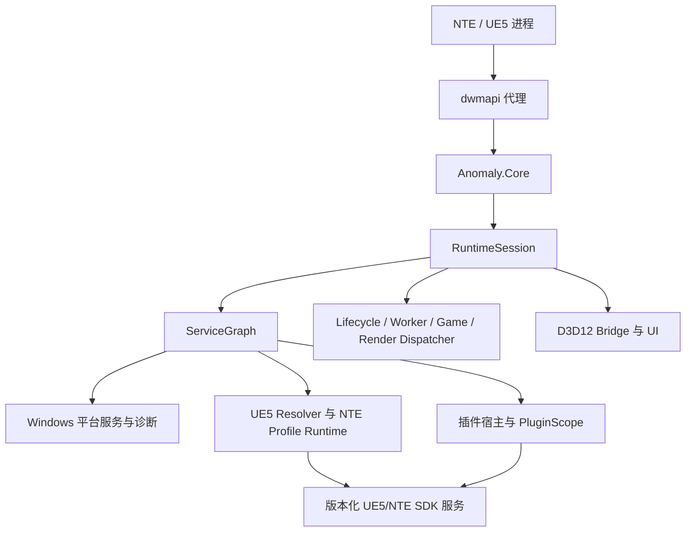

# 架构与所有权地图

## 运行时形态

生产组合根是 `src/runtime/core_main.cpp`；`RuntimeSession` 管理进程生命周期，`ServiceGraph`
管理依赖顺序。Bootstrap 只负责将 Core 安全带入进程。插件宿主、Renderer、NTE Adapter 和
Repository Worker 都是由 Runtime 服务声明的并列所有者，彼此不能形成嵌套所有权。

## 模块契约

| 区域 | 负责内容 | 可依赖 | 禁止依赖 |
| --- | --- | --- | --- |
| `src/bootstrap/dwmapi` | 系统转发和异步 Core 启动 | Win32 Loader、Bootstrap ABI | 配置、Profile、Hook、插件、UI |
| `src/runtime` | Session 状态、ServiceGraph、停止信号、Dispatcher | 平台抽象 | UE5/NTE 布局、渲染细节、插件实现 |
| `src/services`、`src/platform/windows`、`src/diagnostics` | 日志、存储、内存、Pattern、Pipe、Crash | Win32 和 Runtime 合同 | NTE 策略、插件行为 |
| `src/game/ue5` | 通用引擎符号、validator、快照 | 已验证的平台/Runtime 服务 | NTE 专用偏移、包管理策略 |
| `src/game/nte` | 活动 Profile 选择和 NTE 服务 Gate | UE5 Adapter、NTE Profile | 生命周期所有权决策、Build identity 匹配 |
| `src/plugin` | Manifest、依赖、Scope、generation、热重载 | SDK 合同、Runtime 服务 | Renderer 后端内部、固定 NTE 地址 |
| `src/render/dx12`、`src/ui` | SwapChain/输入/UI 与绘制服务 | Render Dispatcher、受控 Hook、插件只读快照 | 包 I/O、DLL 加载、同步 Game Update |
| `src/repository` | 签名 Index、网络 worker、staging、回滚 | Worker/Network、validator | 游戏对象、渲染提交、插件回调 |
| `include/anomaly/sdk` | 稳定公开 C ABI 与 C++ wrapper | 版本化公开合同 | 宿主内部类型 |

## 线程域契约

| 域 | 允许工作 | 禁止工作 |
| --- | --- | --- |
| Bootstrap | 解析导出，在 Loader Lock 外启动 Runtime | 长循环、插件回调 |
| Lifecycle | 服务/插件状态转换、热重载提交、停止 | 直接读取游戏对象、提交 D3D12 命令 |
| Worker | 解析、哈希、扫描准备、Repository 网络 | 使用仅在 Game/Render 线程有效的指针 |
| Game | 已验证 UE5/NTE 更新与快照刷新 | 包发现、同步文件 I/O |
| Render | Present/Resize、ImGui、纹理上传、插件 Draw | DLL 加载、Profile 扫描、阻塞生命周期工作 |
| Diagnostics | 解析请求、采集只读快照、投递 intent | 直接修改 Game/Render 状态 |

Dispatcher 任务必须携带 owner、generation、取消状态和 in-flight lease。禁止在持有
ServiceGraph、Catalog、Scope 或 HookManager 锁时调用插件代码。Render 只能读取快照并投递
Lifecycle intent，不能拥有插件加载过程。

## 变更规则

- 新增 UE5/NTE 地址、布局或能力：必须更新活动 Profile、resolver/validator 覆盖、不可用/降级
  行为和 Adapter 层测试。
- 新增 SDK 字段：必须保持 C 内存布局，使用 `struct_size` 或新的版本化服务表；同步更新 C/C++
  Contract Test 和 ABI Snapshot 预期。
- 新增插件资源（Hook、Subscription、Task、UI、Texture、Patch、IPC）：必须登记到 Scope ledger，
  并在 DLL 卸载前撤销。
- 新增会改变宿主状态的 UI 操作：只能向 Lifecycle 投递 typed work，不能在 `Present` 执行发现、
  磁盘访问、插件重载或网络工作。
- 新增 Repository/Update 路径：必须放在可取消 Worker 中，校验并原子 staging；不得直接调用插件
  或修改游戏状态。
