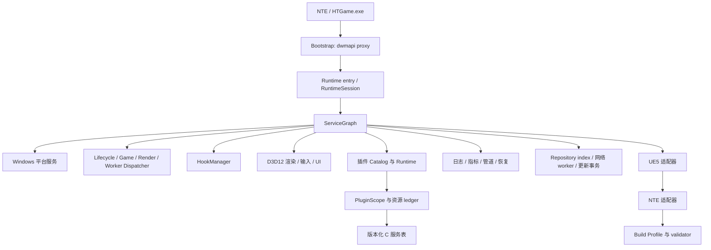

# 架构概览

本页给出 Anomaly 的架构全景，帮助你在动手前建立心智模型。实现层面的模块归属、依赖与线程边界速查见 `.agents/architecture.md`。

## 设计原则

1. Bootstrap、Runtime、渲染、UE5 集成、NTE 集成与插件宿主是彼此独立的**所有权域**。
2. Runtime 内核**与游戏无关**；构建专用的签名、偏移与 validator 属于适配器 Profile。
3. 每个长生命周期资源只有**一个所有者**，并参与确定性的、依赖反序的关停。
4. 公开插件接口是**纯 C ABI**；C++ 实现类型不跨越 DLL 边界。
5. 游戏回调与渲染回调有不同的**线程亲和性**，绝不经由同一条回调路径驱动。
6. 一次推进一个可测试模块。仓库只暴露**一个**当前合同，不保留旧 ABI / Manifest / 协议适配层。

## 组件模型



## 分层与依赖方向

依赖沿声明接口**向下**。Runtime 内核向适配器发布接口，但绝不 include NTE 适配器头文件。跨层回调经由 Dispatcher 投递，而非伸手进入另一层的内部所有者。

| 层 | 拥有 | 不得依赖 |
| --- | --- | --- |
| Bootstrap | 系统 DLL 转发、runtime 发现、启动请求 | 配置、扫描、Hook、插件、UI |
| Runtime 内核 | `RuntimeSession`、生命周期状态、service graph、停止传播 | UE5/NTE 符号、D3D12 细节、插件实现 |
| 平台服务 | 模块、内存、文件、日志、worker 原语 | NTE 语义、插件策略 |
| 插件宿主 | Catalog、兼容性、状态机、Scope、热重载 | D3D12 后端、固定 NTE 地址 |
| Repository / 更新 | 签名 index、有界 bundle、staging、rollback | 游戏对象、渲染提交、插件回调 |
| 渲染 / 输入 / UI | 交换链生命周期、输入路由、UI 服务 | 插件发现、包 I/O、游戏更新调度 |
| UE5 适配器 | 引擎通用的 world/object/name 与游戏线程锚点 | NTE 专用字段、插件管理 |
| NTE 适配器 | 活动 Profile 选择、Feature Gate、高层 NTE 服务 | Runtime 所有权决策 |
| 插件 | 插件自有状态与回调 | 内部头文件、service graph 变更、runtime 单例 |

## 线程域

所有公开回调都标注**唯一亲和性**。Dispatch 任务携带 owner、generation、取消状态与 in-flight lease。Runtime 代码在持有 service graph、插件 catalog 或 hook manager 锁时，**不得**调用插件代码。

| 域 | 主要工作 | 禁止工作 |
| --- | --- | --- |
| Bootstrap | 在 loader lock 之外解析并启动 runtime | 长循环与插件回调 |
| Lifecycle | 服务 / 插件状态转换、reload 提交、停止 | 直接访问游戏对象或渲染提交 |
| Game | UE5 / NTE tick 与 world 事件 | 包扫描与同步文件 I/O |
| Render | D3D12 提交、UI 绘制、纹理上传 | DLL 加载、插件发现、游戏更新 |
| Worker | 哈希、扫描、解析、压缩、后台计算 | 仅在 game/render 线程有效的指针 |
| Diagnostics | 解析请求与采集快照 | 直接 game/render 变更（应改用 dispatch） |

## 所有权与生命周期

`RuntimeSession` 是进程级所有者，拥有 service graph 与 stop source。服务按依赖顺序启动、按依赖反序停止；即使后续服务启动失败，已成功启动的服务也必须被停止。

每个插件 generation 获得一个宿主创建的 `PluginScope`，它记录该插件的每一项宿主资源（订阅、任务、Hook、命令、UI 回调、纹理、Patch、IPC 端点）。卸载流程：

1. 停止新回调并取消排队任务；
2. 以依赖安全的顺序回收资源；
3. 等待仍持有当前 generation lease 的回调；
4. 调用插件 `stop` / `unload`；
5. 仅当 ledger 与 in-flight 计数均为空时才卸载 DLL。

若 drain 超时，该 generation 被 **quarantine**，其 DLL 保持映射——执行已被 unmap 的插件代码，比保留一个被隔离的模块更危险。

## ABI 边界

已安装 SDK 使用定宽整型字段、C 兼容结构、函数表、string view 与 opaque handle。它**排除** STL 容器、C++ 异常、RTTI 对象、内部类与所有权模糊的内存。

插件 ABI 保留一个很小的生命周期内核，并通过 `query_service` 获取彼此独立版本化的服务表。消费者在读取一张表前先校验 `struct_size` 与 `service_version`。跨插件调用使用 `anomaly.ipc`，其资源绑定到插件 ID 与 generation。细节见 [API 参考](../api-reference/README.md)。

## 源码布局

```text
src/bootstrap/dwmapi/   极薄代理入口、导出转发与 Runtime 引导
src/runtime/            RuntimeSession、ServiceGraph 与线程域 Dispatcher
src/services/           结构化日志、可靠存储等 game-agnostic 服务
src/platform/windows/   模块、内存、Pattern 与配置实现
src/diagnostics/        管道、命令分析、CrashReporter 与恢复
src/hook/               Owner-scoped HookManager 与 MinHook backend
src/render/dx12/        Discovery、Bridge、Renderer 与 Input 生命周期
src/ui/                 宿主 UI 服务、管理界面与 Win32 平台宿主
src/plugin/             Catalog、依赖、Scope、Runtime、Shadow 与热重载
src/repository/         Index、签名、bundle、网络 worker 与原子更新事务
src/game/ue5/           Build Profile、Symbol Resolver 与 UE5 Adapter
src/game/nte/           NTE Profile 选择、降级与高层服务接线
```

## 运行时目录边界

```text
Game\Binaries\Win64\
  dwmapi.dll                     入口与系统导出跳板
  Anomaly\
    Anomaly.Core.dll             分析、内存 API、D3D12 ImGui、插件宿主
    anomaly.ini                  平台、Profile 目录与开发覆盖配置
    plugin-repositories.json     第三方插件频道与逐频道启用状态
    repository.json              Profile 更新源与 trust root
    profiles\                    NTE Profile 与迁移模板
    profiles-local\              最高优先级本地 Profile 覆盖
    state\profiles\managed\      Repository 发布的签名 Profile
    state\repository\            插件频道列表与签名 Index cache
    .anomaly-plugin-transactions\ 插件安装的 staging / rollback 临时状态
    state\update-rollback\       插件与 Profile 的上一可用 generation
    state\profile-symbol-cache.json  未绑定 fingerprint / Profile hash 的 RVA cache
    config\plugin-enablement.json    全局插件启用默认值与逐插件 override
    config\plugins\              anomaly.config 管理的插件 JSON 设置
    plugins\                     独立插件包、资源与进程隔离缓存
    logs\anomaly-runtime.log     Runtime 与管道服务日志
    anomaly-platform.log         平台与插件日志
    anomaly-imgui.ini            浮动窗口布局
```

## 架构检查

- 一次干净的 `configure → build → install` 是集成门禁。
- ABI Snapshot 冻结 Windows x64 布局与回调类型。
- 新服务显式声明依赖与线程亲和性。
- 新的 NTE 地址需要 Build Profile 与 validator。
- 新的插件可见资源需要 Scope-ledger 登记与拆除。
- Present / Draw 路径不得扫描包、加载 DLL 或驱动游戏更新。

## 设计决策

上文的[设计原则](#设计原则)与各层边界即是本项目的核心架构决策：单一所有权、游戏无关的 Runtime 内核、纯 C ABI、线程域分离、单一当前合同。新增服务、NTE 地址或插件可见资源时，须遵守对应的[架构检查](#架构检查)。
